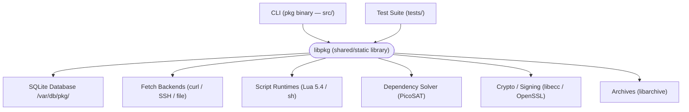
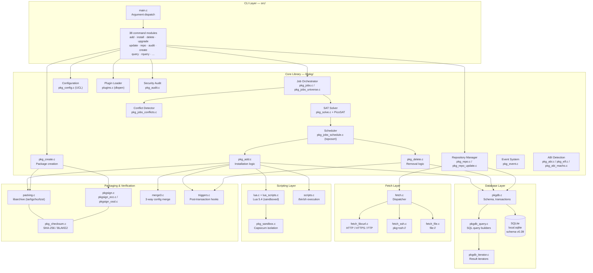
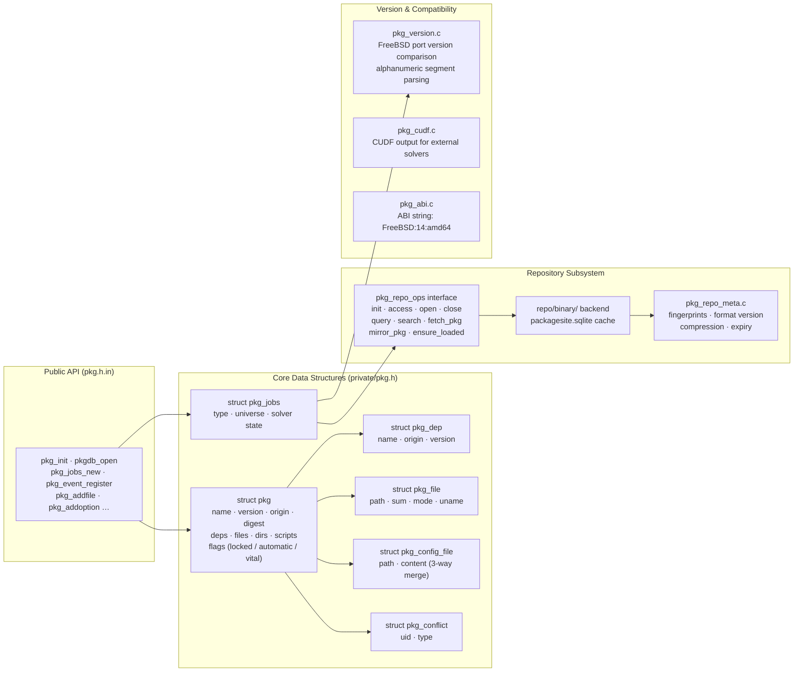
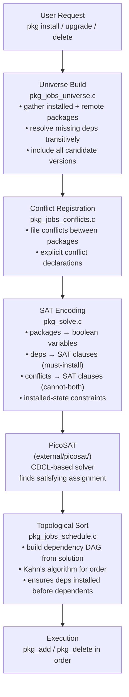
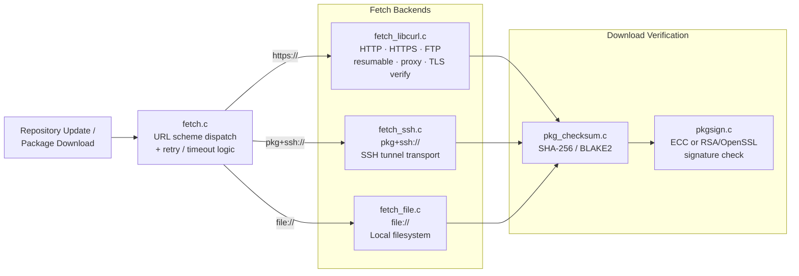
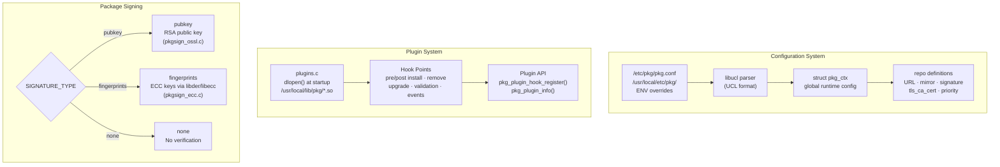
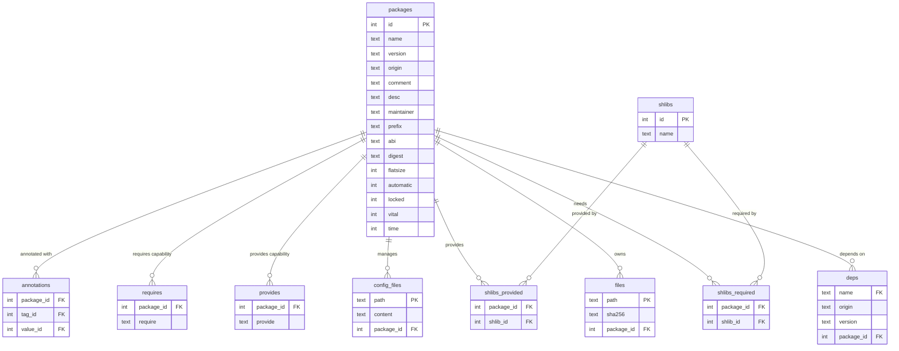
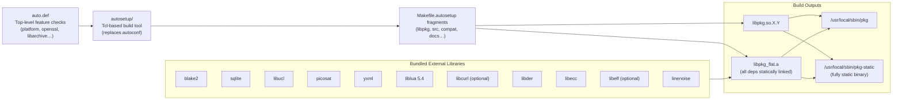
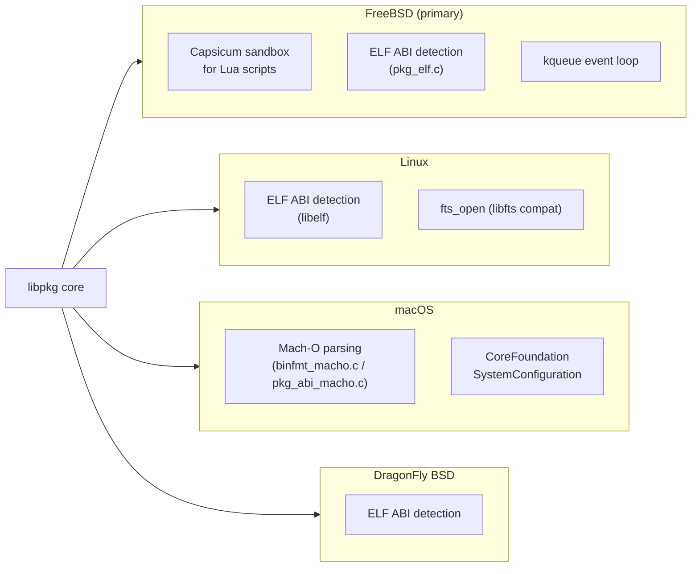

# pkg Software Architecture

FreeBSD's `pkg` is a binary package management system built as a layered architecture: a thin CLI frontend (`pkg` binary) over a comprehensive shared library (`libpkg`), supported by pluggable fetch backends, a SAT-based dependency solver, and an SQLite local database.

---

## High-Level Component Overview

---

## Repository Layers

---

## Internal `libpkg` Module Map

---

## Dependency Solver Architecture

---

## Fetch & Network Stack

---

## Configuration & Plugin Systems

---

## Database Schema (key tables)

---

## Build System

---

## Platform Support Matrix

