# pkg Supporting Workflows

This document describes the major operational workflows in `pkg`, tracing control flow from the CLI through `libpkg` to completion.

---

## `pkg update` — Refresh Repository Metadata

Fetches the latest package index from all configured repositories and updates the local cache.

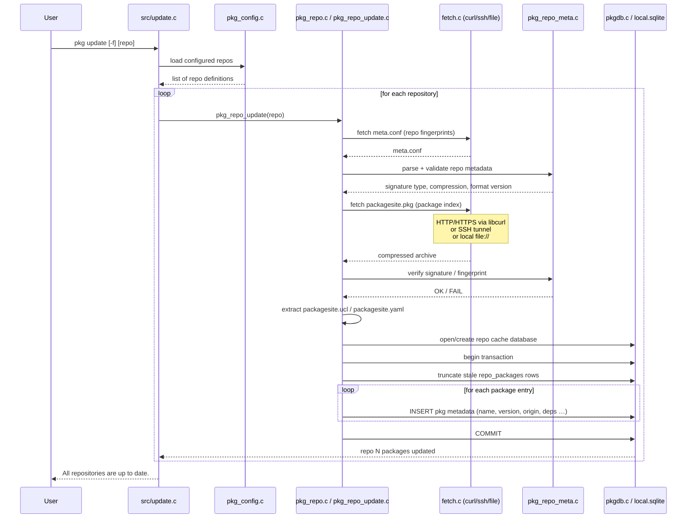

---

## `pkg install` — Install Packages with Dependencies

Resolves the full dependency graph, then installs each package in topological order.

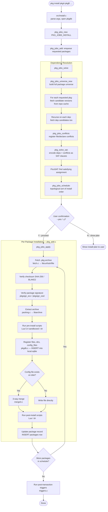

---

## `pkg upgrade` — Upgrade Installed Packages

Compares installed versions against the current repo index and calculates a minimal upgrade plan.

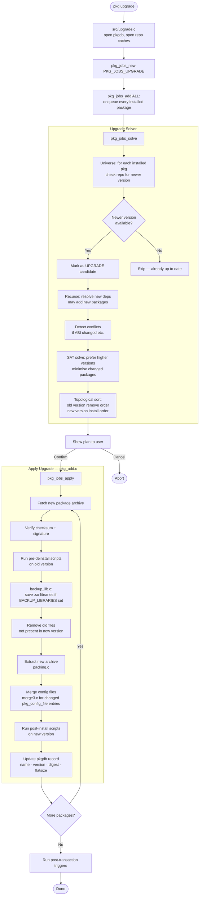

---

## `pkg delete` — Remove Packages

Removes packages and their registered files, optionally cascading to reverse dependencies.

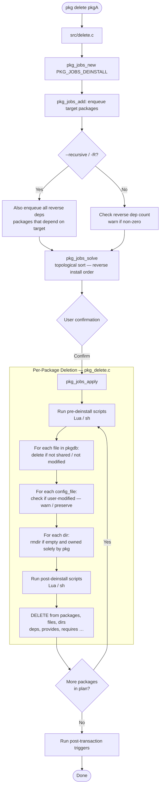

---

## `pkg create` — Build a Package Archive

Packages a staged directory or an installed package into a distributable `.pkg` file.

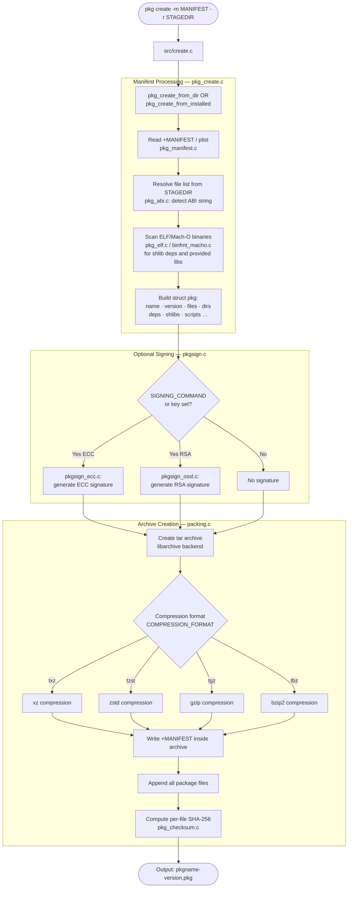

---

## `pkg repo` — Create a Repository

Indexes a directory of `.pkg` files into a repository suitable for `pkg update` consumption.

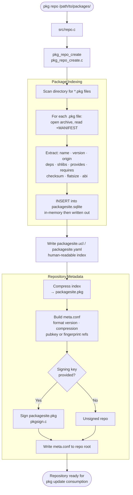

---

## `pkg audit` — Security Vulnerability Check

Checks installed packages against the FreeBSD VuXML vulnerability database.

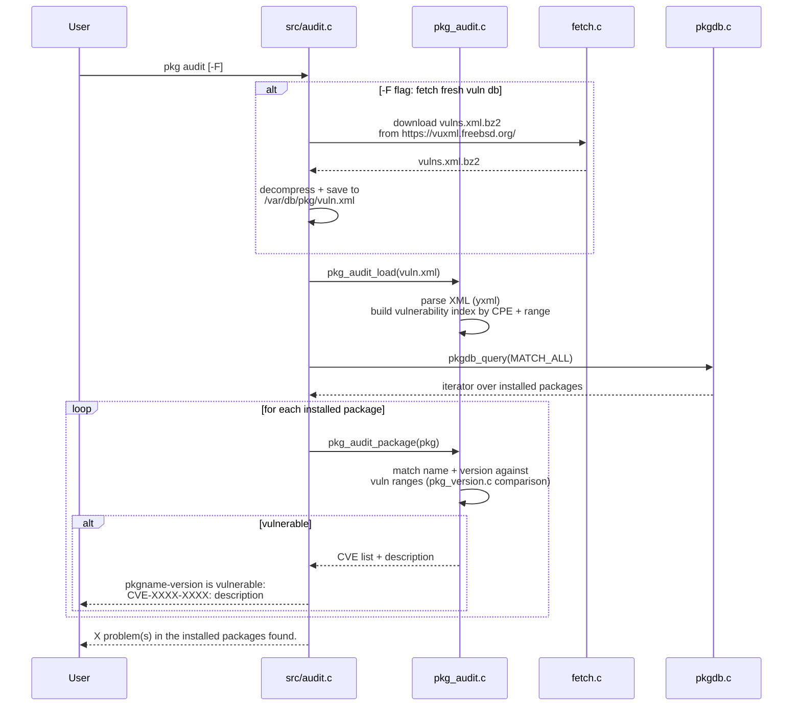

---

## `pkg fetch` — Download Without Installing

Downloads package archives to the local cache without modifying the system.

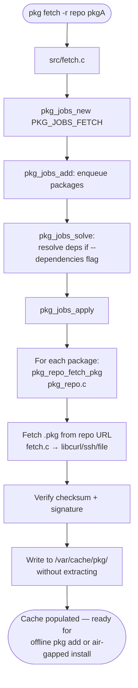

---

## Lua Script Execution Lifecycle

Lua scripts are the preferred, sandboxed alternative to shell scripts for package hooks.

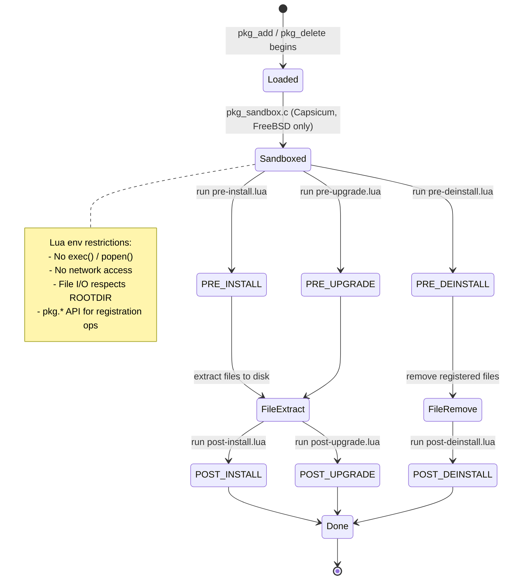

---

## Post-Transaction Trigger Execution

Triggers run once per transaction (not per package), deduplicating common post-install tasks.

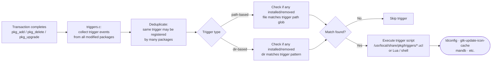

---

## Plugin Hook Integration

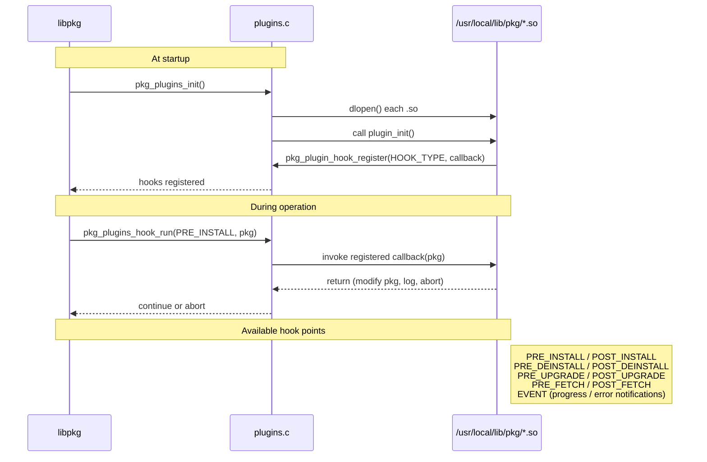
